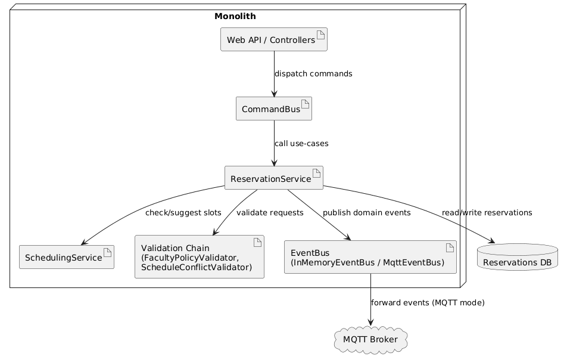
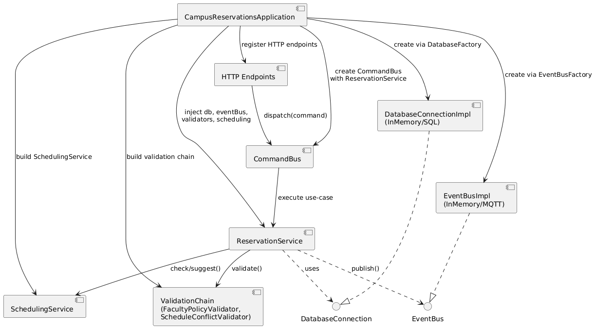
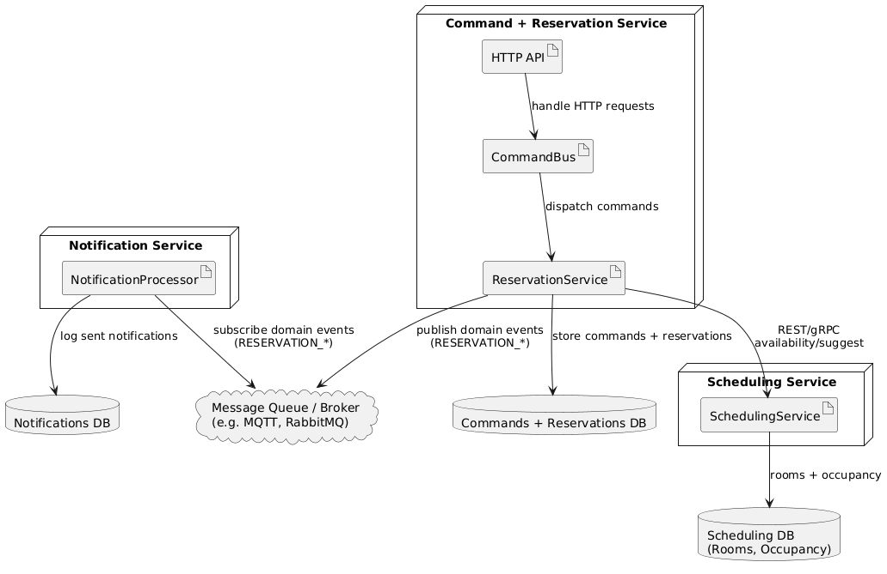
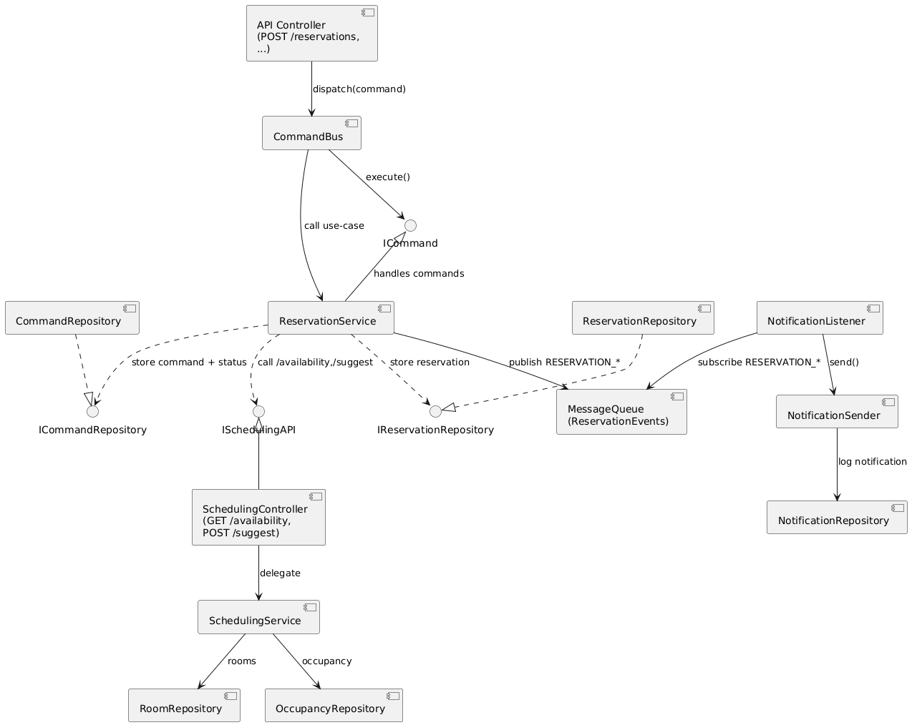
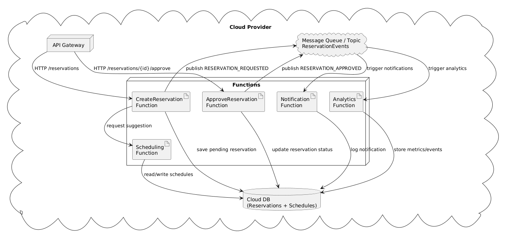
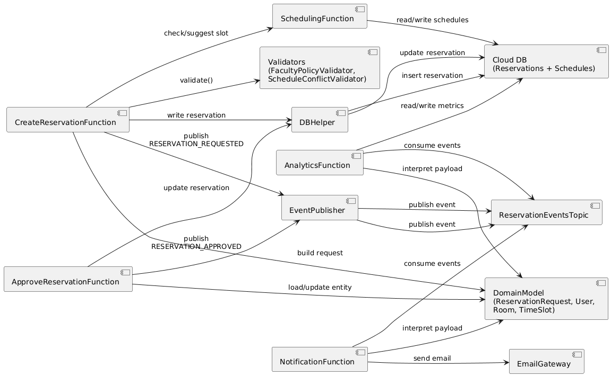

# Campus Reservations – Architecture Evaluation

## 1. Monolithic Architecture

In the monolithic version we run a single deployable application and a single database. The main layers and components are:

- Application layer: commands and a `CommandBus` that represent use-cases and are exposed via HTTP endpoints.
- Services: `ReservationService` (core reservation lifecycle) and `SchedulingService` (availability checks and room suggestions).
- Validation: a chain of responsibility (`FacultyPolicyValidator`, `ScheduleConflictValidator`) that runs before a reservation is persisted.
- Strategy: `SlotSelectionStrategy` / `LowestConflictStrategy`, used by `SchedulingService` to pick a room among candidates.
- Eventing: an `EventBus` abstraction with concrete implementations `InMemoryEventBus` or `MqttEventBus` for domain events.
- Domain: `ReservationRequest`, `User`, `Room`, `TimeSlot` and supporting enums (`ReservationStatus`, `Role`), used across services and validators.
- Infrastructure: a `DatabaseConnection` abstraction with in-memory or SQL implementations created via a factory.

At runtime, everything lives in a single process. The `CampusReservationsApplication` entry point is responsible for wiring things together:

- It creates the `DatabaseConnection` (in-memory or SQL) and the `EventBus` (in-memory or MQTT) using the existing factories.
- It builds the `SchedulingService`, configures a `SlotSelectionStrategy`, and assembles the validation chain (`FacultyPolicyValidator -> ScheduleConflictValidator`).
- It constructs the `ReservationService` by injecting the database connection, event bus, validation chain, and `SchedulingService`.
- It creates a `CommandBus` that holds a reference to `ReservationService` and registers HTTP endpoints that translate incoming requests into commands.

A typical HTTP request (for example `POST /reservations` or an approval endpoint) is handled by a controller that builds a `CreateReservationCommand` or `ApproveReservationCommand` and passes it to `CommandBus.dispatch(command)`. The `CommandBus` calls into `ReservationService` in the same process, which runs validation, talks to `SchedulingService` if needed, persists the `ReservationRequest` through `DatabaseConnection`, publishes domain events via the `EventBus`, and returns the result back to the controller. The controller then serializes that result into the HTTP response. All of this happens inside a single application and database, but with boundaries that match the later microservices and serverless variants.

### Monolith Deployment Diagram

### Monolith Component Diagram

**Pros:**

- Simple to develop, run, and debug (one app, one DB).
- No network calls between internal components.
- Easy to understand for new team members.

**Cons:**

- We can only scale the whole application, not individual parts.
- As the codebase grows, deployments become more risky and slower.
- Technology choices are coupled across the whole system.

---

## 2. Microservices Architecture

We split the system into three services, each running in its own process with its own database or schema:

- **Command + Reservation Service**
  - Exposes HTTP/gRPC endpoints (e.g. `POST /reservations`).
  - Hosts the `CommandBus`, commands, `ReservationService`, validation chain, and reservation domain logic.
  - Owns a **Commands + Reservations DB**, storing incoming commands with an idempotency key and status (`PENDING`, `APPROVED`, `REJECTED`/`REVOKED`) plus the corresponding reservation records.
  - Publishes domain events such as `RESERVATION_REQUESTED` and `RESERVATION_APPROVED` to a message queue (MQTT topic or similar).

- **Scheduling Service**
  - Owns room, occupancy, and timeslot logic.
  - Exposes APIs like `GET /availability` and `POST /suggest`.
  - Uses its own **Scheduling DB** for room definitions, equipment, and blocked time slots.

- **Notification Service**
  - Subscribes to domain events on the message queue (for example `RESERVATION_REQUESTED`, `RESERVATION_APPROVED`, `RESERVATION_REJECTED`).
  - Sends emails or other notifications based on those events.
  - Uses a **Notifications DB** for sent notifications, templates, or user preferences.

In a typical create-reservation flow, the Command + Reservation Service receives POST /reservations, writes a PENDING command with an idempotency key, checks for duplicates, runs the validation chain, and then calls the Scheduling Service APIs directly to detect conflicts or get suggestions using the Scheduling DB. Based on the result, it updates the reservation and command status in its own database and finally publishes a reservation event to the message queue. The Notification Service reacts to events (for example RESERVATION_APPROVED) by looking up templates and recipient data, sending notifications, and logging them. Other consumers such as an Analytics Service can be added later by subscribing to the same events on the queue without changing these three core services.

### Microservices Deployment Diagram

### Microservices Component Diagram

**Pros:**

- Clear separation of concerns between:
  - Command + Reservation (entrypoints, idempotency, reservation lifecycle),
  - Scheduling (rooms and occupancy),
  - Notifications (side effects based on domain events).
- The Commands + Reservations DB supports idempotent processing and auditing of commands.
- Each service can be scaled, updated, and deployed independently.
- Notifications are loosely coupled: they react to events in a message queue rather than being called directly.
- Fault isolation: failure in the Notification Service does not block the main reservation flow; events can be retried from the queue.

**Cons:**

- Higher operational complexity (monitoring, CI/CD per service, message broker).
- Requires well-defined API contracts between Command + Reservation and Scheduling, and clear event formats on the queue.
- More moving parts to coordinate when changing cross-service flows.

---

## 3. Event-Driven Serverless Architecture

In the serverless variant we implement the main flows as cloud functions. The cloud provider manages runtime and scaling, and we model important changes as domain events.

- `CreateReservation` function
  - Trigger: HTTP request when a student submits a form.
  - Steps: validate the request using shared validators, call a scheduling function, write to a cloud database, then publish a `RESERVATION_REQUESTED` event.
- `ApproveReservation` function
  - Trigger: HTTP request when an approver acts.
  - Steps: load and update the reservation, write to the DB, publish `RESERVATION_APPROVED`.
- `SchedulingFunction`
  - Trigger: direct invocation from other functions.
  - Contains the logic from `SchedulingService` for availability checks and suggestions.
- Notification and analytics functions
  - Trigger: messages for `RESERVATION_REQUESTED`, `RESERVATION_APPROVED`, and similar event types.
  - React to events and send emails or record metrics.

Shared entities, validators, and database helpers are extracted into a common library or runtime layer that all functions reuse. Functions are triggered by HTTP events, message-queue events, or scheduled timers, and they react to domain events instead of calling each other directly.

### Event-Driven Serverless Deployment Diagram

### Event-Driven Serverless Component Diagram

**Pros:**

- No server or process management; the cloud provider handles provisioning and scaling.
- Good for spiky or occasional workloads and background tasks.
- Easy to add new behaviours by subscribing new functions to existing events.

**Cons:**

- The main booking flow is multi-step and stateful, which is harder to follow when split across many functions.
- Stronger coupling to a specific cloud provider and its limits.
- Cold starts and resource limits can impact response times for interactive users.

---

## 4. Final Comparison and Choice

### Summary

- Monolithic
  - Simple, one deployment, ideal for early development and for teaching.
  - Limited scaling per component and less flexibility as the system grows.

- Microservices
  - Splits the system into:
    - Command + Reservation Service (with Commands + Reservations DB and idempotent command handling),
    - Scheduling Service (with Scheduling DB),
    - Notification Service (listening on a message queue).
  - Fits our logical boundaries and supports independent scaling and deployment of each core concern.
  - Works well with our existing event concepts and allows new services (extra notifications, analytics, reporting) to be added by subscribing to the same events on the message queue.
  - Requires more infrastructure and operational tooling, but there is a clear evolution path from the current design.

- Event-Driven Serverless
  - Minimal infrastructure management and naturally event-driven.
  - Better suited for auxiliary tasks than for the core multi-step reservation flow in our case.

### Our choice

For Campus Reservations, our preferred long-term architecture is the microservices approach. The current codebase (proof-of-concept) already has clear boundaries that map well to a Command + Reservation Service (with idempotent command handling and its own database), a Scheduling Service (owning room and schedule data), and a Notification Service (subscribing to events from a message queue). Turning these into separate services gives us independent scaling, clearer ownership, and room to add new services such as extended notifications or analytics by subscribing to the same domain events.
