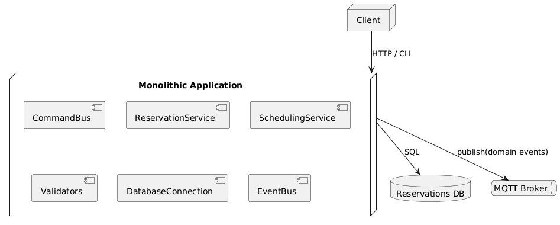
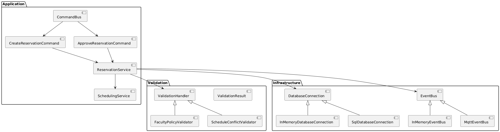
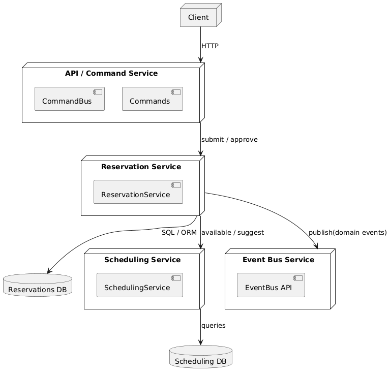
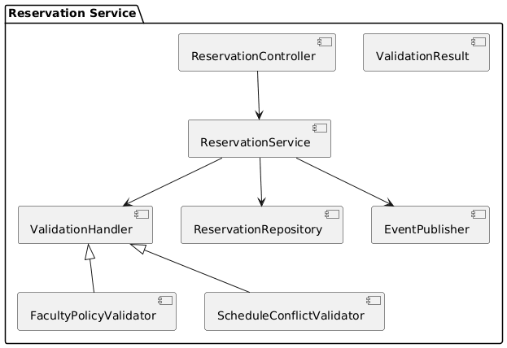
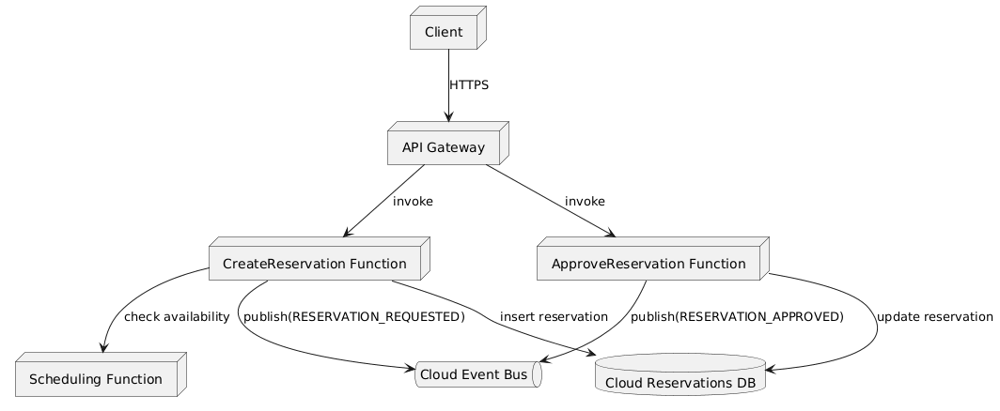
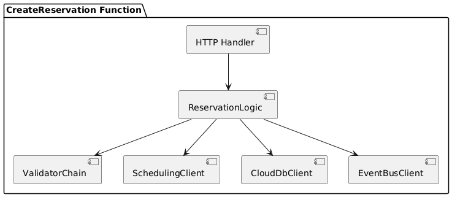

# Campus Reservations – Architecture Evaluation (Milestone 3)

## 1. Monolithic architecture

### Deployment diagram

### Component diagram

### Monolith – Evaluation

- **Pros**
  - Simple to run and debug (single deployment, single DB).
  - No network calls between internal components.
  - Good fit for early stages and a small team.
- **Cons**
  - You can only scale the whole application, not individual parts.
  - As the codebase grows, changes become harder and deployments riskier.
  - Harder to introduce different tech stacks for different concerns.

---

## 2. Microservices architecture

The current design already has clear boundaries (`ReservationService`, `SchedulingService`, validators, event bus). A natural microservice split is:

- **API / Command Service**
  - Exposes HTTP/gRPC endpoints to clients.
  - Contains `CommandBus` plus the command classes (`CreateReservationCommand`, `ApproveReservationCommand`, …).
  - Forwards calls to the Reservation and Scheduling services via network APIs instead of in-process calls.

- **Reservation Service**
  - Owns `ReservationService`, the validation chain (`ValidationHandler`, `FacultyPolicyValidator`, `ScheduleConflictValidator`, `ValidationResult`) and reservation domain types (`ReservationRequest`, `User`, `FacultyPolicy`, `ReservationStatus`, …).
  - Owns its own **Reservations DB** accessed via a local `DatabaseConnection` implementation.
  - Publishes domain events (`RESERVATION_REQUESTED`, `RESERVATION_APPROVED`, …) to the event bus service.

- **Scheduling Service**
  - Owns `SchedulingService`, room and timeslot entities, and strategies like `SlotSelectionStrategy` / `LowestConflictStrategy`.
  - Exposes APIs such as `available(roomId, slot)` and `suggest(request)`.

- **Event Bus Service**
  - Wraps the underlying broker (for example MQTT) behind a simple HTTP/gRPC or message-based interface.
  - Other services (e.g. notifications service) subscribe to events such as `RESERVATION_REQUESTED` and `RESERVATION_APPROVED`.

### Deployment diagram

### Reservation service component diagram

### Microservices – Evaluation

- **Pros**
  - Matches existing code boundaries; refactor mostly involves moving classes into separate services and adding APIs.
  - Each service can scale independently (e.g., heavy scheduling traffic vs. approval traffic).
  - Easier to add new capabilities (notifications, analytics) by subscribing to existing events.
- **Cons**
  - Requires DevOps investment (service discovery, monitoring, distributed logging, CI/CD per service).
  - Cross-service workflows (validate → schedule → save → publish) need sagas or idempotent patterns instead of a single local transaction.

Overall, microservices are the most suitable **long-term** architecture for this project.

---

## 3. Serverless architecture

A serverless variant would implement flows as cloud functions while reusing the same domain and validation logic as libraries.

### Example breakdown

- `CreateReservation` function
  - Validates the request, calls a scheduling function, writes to a cloud database, publishes `RESERVATION_REQUESTED`.
- `ApproveReservation` function
  - Checks that the request exists, updates it, publishes `RESERVATION_APPROVED`.
- `SchedulingFunction`
  - Contains the room-availability and suggestion logic currently in `SchedulingService`.

Shared code for entities, validators, and DB access can be packaged as a common library or runtime layer.

### Deployment diagram

### CreateReservation component diagram

### Serverless – Evaluation

- **Pros**
  - No server management; automatic scaling.
  - Good for occasional or spiky workloads and background jobs.
- **Cons for this project**
  - Core flows are multi-step and stateful; splitting them across functions complicates reasoning and debugging.
  - Stronger coupling to a specific cloud platform.
  - Cold starts and resource limits can hurt user experience.

Serverless works better here for auxiliary jobs (notifications, periodic clean-ups, exports) than for the main booking flow.

---

## 4. Comparison

### Final Comparison

- **Modular monolith**
  - Strengths: very simple, single deployment, good for early development and teaching; all current code already fits this model.
  - Weaknesses: scales only as a whole; gets harder to change as more features and developers are added.

- **Microservices**
  - Strengths: lines up neatly with existing boundaries (`ReservationService`, `SchedulingService`, `EventBus`); enables independent scaling and deployment; event-driven design is already present.
  - Weaknesses: increases operational complexity and requires good tooling for observability and automation.

- **Serverless**
  - Strengths: minimal infrastructure management; good for on-demand or background tasks.
  - Weaknesses: less natural for the stateful, multi-step reservation flows; debugging and testing end-to-end is more complex.

### Most Suitable Architecture
